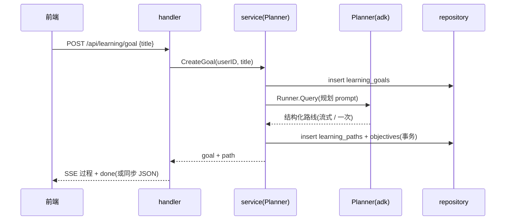
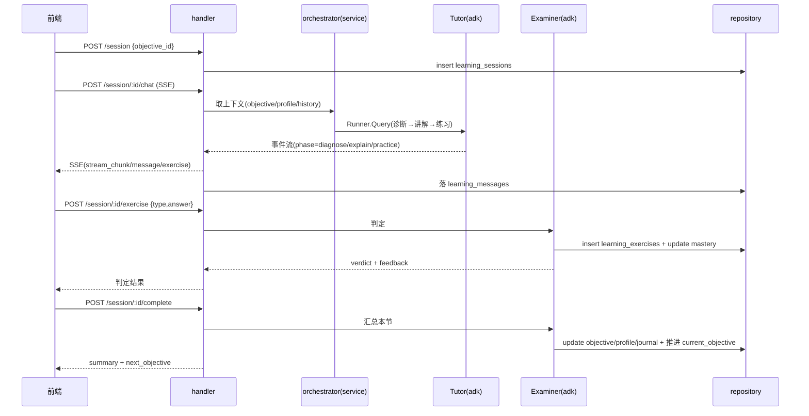
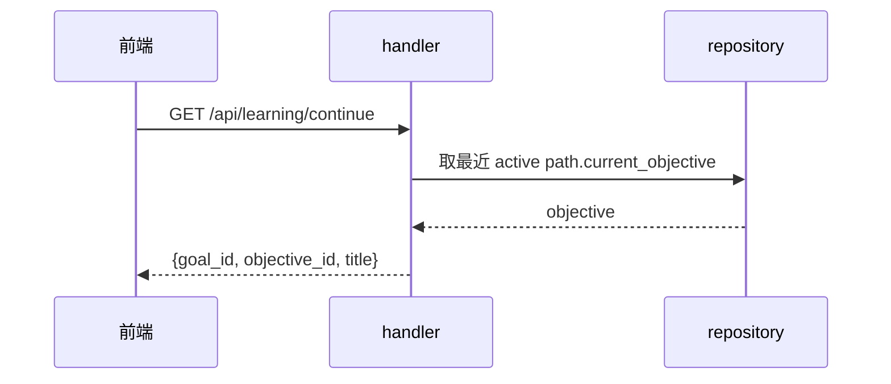

# 04 · 核心流程时序

> 参与者:前端 / handler / service(含 orchestrator)/ agent(adk Runner)/ repository(bun)/ Postgres。

## 流程一:创建目标 → 生成路线

## 流程二:上一节课(核心闭环)

## 流程三:次日继续

> 说明:流程二里 chat 与 exercise 是分开的请求 —— 陪练走 SSE 流式,验证提交走普通 POST 同步返回判定;两者都落库,`complete` 收尾时统一写画像 / 日志并推进进度。
