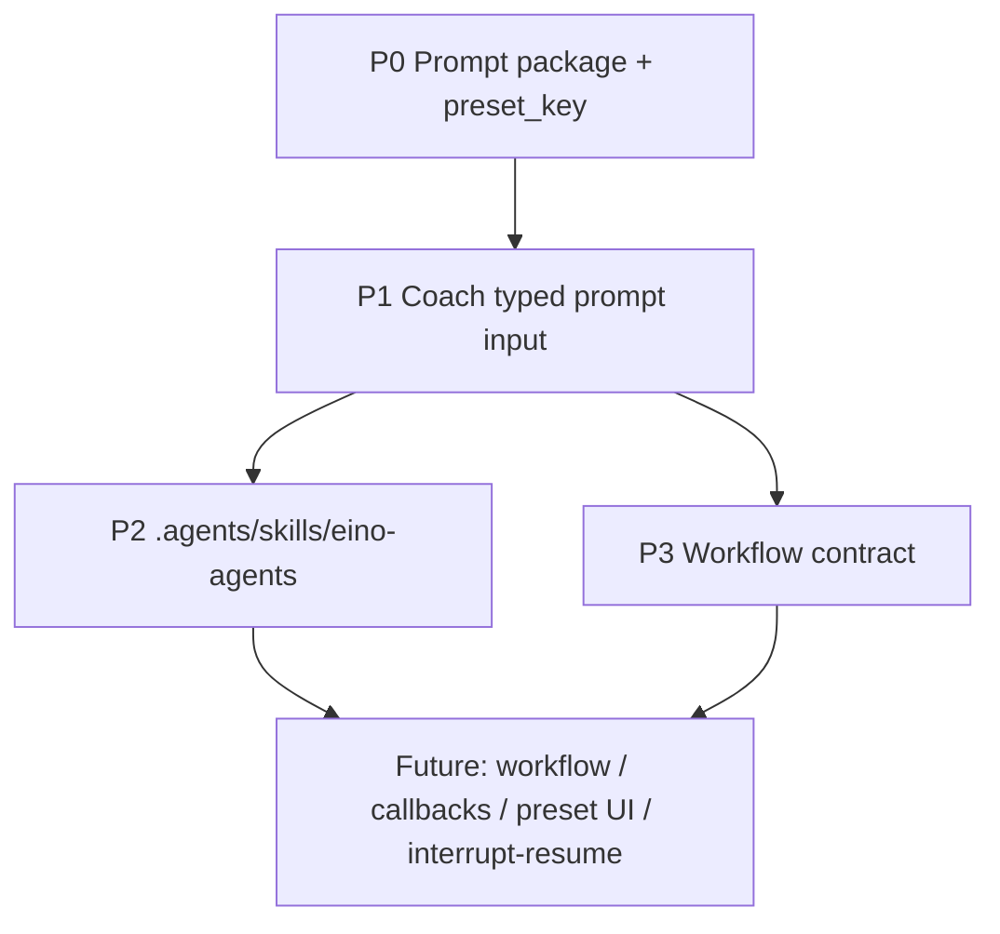

# refactor: Build Eino Agent Foundation

## Overview

Build the foundation described in `docs/product/05-Eino改进落地路线.md`: first structure Eino prompts, then move Coach context rendering behind typed input, then document agent-development conventions in one project skill, and finally write the workflow contract that decides whether a server-side learning workflow is worth implementing.

This plan is intentionally staged. P0 can be implemented immediately as a behavior-preserving backend refactor. P1, P2, and P3 should follow in order, because each stage reduces ambiguity for the next one.

## Problem Frame

Verve currently uses Eino ADK through five independent `ChatModelAgent` constructors in `server/infrastructure/llm/agent.go`. That file also owns long prompt strings, while `server/app/learning/service/coach.go` still builds the Coach runtime prompt by hand from wiki folders, documents, objectives, profiles, and journals.

The product direction in `docs/product/05-Eino改进落地路线.md` is to make the system progressively more agent-native without over-expanding into preset UI, workflow orchestration, callbacks, interrupt/resume, and developer skills all at once:

1. Prompt 可配置。
2. 上下文有结构。
3. Agent 开发约定可复用。
4. 会话 workflow 有 contract 后再实现。

## Requirements Trace

- R1. Move the five agent instruction bodies out of `server/infrastructure/llm/agent.go` while preserving equivalent text and behavior.
- R2. Add a dedicated prompt package under `server/infrastructure/llm/prompts/` with a minimal `preset_key` extension point.
- R3. Refactor Coach prompt rendering so service code maps runtime data into typed prompt input instead of owning the whole Markdown rendering flow.
- R4. Add one project-local agent development skill, `.agents/skills/eino-agents/SKILL.md`, that reflects live Verve file locations and conventions.
- R5. Write a workflow contract document before implementing any server-side workflow, including state, SSE, recovery, and writeback boundaries.
- R6. Keep user-facing learning behavior, routes, SSE event names, database schema, and frontend pages unchanged until a later product-specific plan explicitly changes them.

## Scope Boundaries

- Do not add onboarding, settings, learning-style cards, or preset UI.
- Do not add database fields or migrations for preferred learning style.
- Do not implement Eino workflow, callbacks, interrupt/resume, or workflow-as-tool in this plan.
- Do not change existing tool registration behavior unless the relevant stage explicitly calls it out.
- Do not change frontend routes or learning page layouts.
- Do not turn `.agents/skills/` into a full registry system; write only the `eino-agents` skill in this plan.

## Context & Research

### Relevant Code and Patterns

- `server/infrastructure/llm/agent.go` currently contains all five instruction strings and all five ADK agent constructors.
- `server/app/learning/service/coach.go` currently renders Coach runtime context into Markdown prompt text inside `BuildCoachQuery`.
- `server/app/learning/service/coach_test.go` already tests the current Coach prompt output and `ParseCoachAction`.
- `server/app/learning/handlers/coach.go` calls `BuildCoachQuery` and streams Coach output through existing SSE helpers.
- `server/app/learning/handlers/sse_events.go` already owns the learning SSE event vocabulary and should remain the source of truth for current event names.
- `docs/product/05-Eino改进落地路线.md` defines the order as P0 prompt structure, P1 typed Coach input, P2 `eino-agents` skill, P3 workflow contract.

### Institutional Learnings

- Prior Verve learning work should defer to the live repository after the rollback guard; local files are the source of truth.
- The Guide Agent should reuse the existing Eino/ADK learning-agent pattern in `server/infrastructure/llm/agent.go` and the learning service/handler structure under `server/app/learning/*`.
- Learning UI and workflow work should avoid front-end-only fake behavior; this plan keeps UI unchanged and only prepares backend and documentation structure.

### External References

- External research is not required for this plan. The work follows existing local Eino ADK usage and project documentation. Later implementation of workflow, callbacks, or interrupt/resume may require fresh Eino documentation lookup.

## Key Technical Decisions

- Use one staged plan instead of four disconnected plans: this keeps the roadmap visible while still allowing P0 to be executed independently.
- Use a new `prompts` package before touching Coach typed input: prompt ownership must be separated before runtime prompt rendering moves there.
- Use simple Go input structs and prompt functions first, not Eino `ChatTemplate`: this gives enough structure for `preset_key` and typed context without making P0 a framework migration.
- Keep `preset_key` as an extension point, not a product feature: only default behavior is active until a future product plan proves real preset differences.
- Add only one skill, `eino-agents`: the repo needs one reliable agent-development guide before splitting into `learning-domain`, `sse-events`, or other skills.
- Write workflow contract before workflow implementation: if the contract cannot show value beyond moving frontend phase state to backend, the workflow should not be built yet.

## Open Questions

### Resolved During Planning

- Should the plan cover only P0? No. It should cover the route from P0 to P3, with P0 as the first executable phase.
- Should the first phase implement user-facing preset selection? No. It only introduces `preset_key` as an extension point.
- Should this use full Eino `ChatTemplate` immediately? No. The plan starts with simple prompt inputs and leaves `ChatTemplate` as a future migration option.
- Should workflow be implemented here? No. This plan ends at a workflow contract, not workflow code.

### Deferred to Implementation

- Exact prompt helper names and file split may shift during P0, as long as the package remains under `server/infrastructure/llm/prompts/`.
- Exact Coach prompt input item structs may shift during P1, as long as `BuildCoachQuery` remains behaviorally compatible while callers are unchanged.
- Exact workflow name should be decided in P3 after comparing `RecoveryWorkflow`, `FeynmanSessionWorkflow`, and `LearningSessionWorkflow` against the contract.

## High-Level Technical Design

> *This illustrates the intended approach and is directional guidance for review, not implementation specification. The implementing agent should treat it as context, not code to reproduce.*

P0 changes where prompts live. P1 changes how Coach context enters prompt rendering. P2 records the development convention so later agent changes do not depend on oral memory. P3 decides the shape of workflow before implementation.

## Implementation Units

- [x] **Unit 1: P0 Create Prompt Package**

**Goal:** Create `server/infrastructure/llm/prompts/` and move the five static instruction bodies into dedicated prompt files with default preset support.

**Requirements:** R1, R2, R6

**Dependencies:** None

**Files:**
- Create: `server/infrastructure/llm/prompts/preset.go`
- Create: `server/infrastructure/llm/prompts/guide.go`
- Create: `server/infrastructure/llm/prompts/objective_generator.go`
- Create: `server/infrastructure/llm/prompts/coach.go`
- Create: `server/infrastructure/llm/prompts/tutor.go`
- Create: `server/infrastructure/llm/prompts/examiner.go`
- Create: `server/infrastructure/llm/prompts/prompts_test.go`
- Modify: `server/infrastructure/llm/agent.go`

**Approach:**
- Define a minimal default preset concept in `preset.go`; it should represent current behavior, not a user-facing style system.
- Give each agent prompt one render entry point that accepts a small input object, even if the only field used today is `preset_key`.
- Keep prompt text equivalent to the current strings in `agent.go`.
- Avoid template DSLs, product-level preset branching, or `ChatTemplate` migration in this unit.

**Patterns to follow:**
- Existing instruction content in `server/infrastructure/llm/agent.go`.
- Existing Go package organization under `server/infrastructure/llm/`.

**Test scenarios:**
- Happy path: each default agent prompt returns non-empty text containing the same critical markers as today, such as JSON-only constraints for structured agents and `<ACTION>` constraints for Coach.
- Edge case: empty or unknown preset input falls back to default behavior rather than returning an empty prompt.
- Regression: Tutor, Guide, ObjectiveGenerator, Coach, and Examiner prompt renderers remain independently testable without creating Eino agents.

**Verification:**
- `server/infrastructure/llm/agent.go` no longer owns large prompt prose.
- Prompt package tests prove default prompt rendering works for all five agents.

- [x] **Unit 2: P0 Wire Agent Constructors to Prompts**

**Goal:** Update Eino ADK agent constructors to call prompt package renderers while preserving constructor signatures and runtime behavior.

**Requirements:** R1, R2, R6

**Dependencies:** Unit 1

**Files:**
- Modify: `server/infrastructure/llm/agent.go`
- Test: `server/infrastructure/llm/prompts/prompts_test.go`
- Test: `server/app/learning/service/guide_test.go`
- Test: `server/app/learning/service/examiner_test.go`
- Test: `server/app/learning/service/objective_generation_test.go`

**Approach:**
- Replace direct instruction constants with calls into `server/infrastructure/llm/prompts`.
- Keep `NewGuideAgent`, `NewObjectiveGeneratorAgent`, `NewCoachAgent`, `NewTutorAgent`, and `NewExaminerAgent` signatures stable.
- Keep existing model selection and tool config behavior untouched.

**Patterns to follow:**
- Existing `adk.NewChatModelAgent` construction in `server/infrastructure/llm/agent.go`.
- Existing service tests that exercise guide, examiner, and objective generation parsing.

**Test scenarios:**
- Happy path: existing service tests continue to pass with agents using prompt package instructions.
- Regression: `NewCoachAgent` and `NewTutorAgent` still attach tool config exactly as before.
- Regression: Guide and ObjectiveGenerator still use the structured chat model path.
- Regression: Examiner constructor still accepts tools while current service usage may pass none.

**Verification:**
- Existing backend service behavior remains unchanged from callers' perspective.
- Agent constructors are shorter and no longer own prompt prose.

- [ ] **Unit 3: P1 Move Coach Rendering Behind Typed Input**

**Goal:** Refactor Coach runtime-context rendering so service code maps runtime data into a typed prompt input and prompt rendering owns the Markdown output.

**Requirements:** R3, R6

**Dependencies:** Unit 1, Unit 2

**Files:**
- Modify: `server/app/learning/service/coach.go`
- Modify: `server/app/learning/service/coach_test.go`
- Modify: `server/infrastructure/llm/prompts/coach.go`
- Test: `server/app/learning/service/coach_test.go`
- Test: `server/infrastructure/llm/prompts/prompts_test.go`

**Approach:**
- Keep `BuildCoachQuery` as the service-facing API so `server/app/learning/handlers/coach.go` does not need broad rewiring.
- Add a mapping step from `CoachRuntimeContext` plus user message into Coach prompt input.
- Move Markdown section rendering for Wiki folders, documents, objectives, profiles, journals, and action instructions into the prompt layer.
- Keep `ParseCoachAction` in `server/app/learning/service/coach.go`; it parses agent output and does not belong in prompt rendering.

**Patterns to follow:**
- Current `BuildCoachQuery` output shape in `server/app/learning/service/coach.go`.
- Existing assertions in `server/app/learning/service/coach_test.go`.

**Test scenarios:**
- Happy path: context with folder, document, objective, profile, and journal renders all expected identifying details.
- Edge case: documents exist but objectives are empty, so the prompt still tells Coach to call `create_learning_objectives`.
- Edge case: no folders, documents, objectives, profiles, or journals renders explicit empty-state language instead of omitting sections.
- Regression: prompt still contains the `<ACTION>` contract for `navigate_to_practice`.
- Regression: `ParseCoachAction` still finds a valid action in assistant output and ignores invalid or missing action blocks.

**Verification:**
- `BuildCoachQuery` remains available and behaviorally compatible.
- Coach rendering tests prove the refactor did not remove key context or action instructions.

- [ ] **Unit 4: P2 Add `eino-agents` Skill**

**Goal:** Add one project-local skill that documents the live Verve convention for adding or modifying Eino agents.

**Requirements:** R4

**Dependencies:** Unit 1, Unit 2, preferably Unit 3

**Files:**
- Create: `.agents/skills/eino-agents/SKILL.md`
- Modify: `docs/product/05-Eino改进落地路线.md` only if the implemented convention differs materially from the documented route

**Approach:**
- Document current file ownership: prompt package, agent constructors, tools, service callers, handlers, SSE event mapping, and tests.
- Make the skill practical, not aspirational: it should tell future coding agents what to inspect and where to add code in this repo today.
- Include explicit guidance for when not to create a new agent and when to extend an existing one.
- Do not create `learning-domain`, `sse-events`, `sag-ui`, or registry-generation skills in this unit.

**Patterns to follow:**
- Project-local skill layout already present under `.agents/skills/shadcn`.
- Existing project rules in `AGENTS.md`.

**Test scenarios:**
- Test expectation: none -- this unit creates agent-facing documentation, not runtime behavior.

**Verification:**
- The skill points to repo-relative paths that exist.
- A future agent can follow it to identify prompt, tool, service, handler, SSE, and test locations without reading the product docs first.

- [ ] **Unit 5: P3 Write Workflow Contract**

**Goal:** Write a contract document that decides the shape and value of a future server-side learning workflow before any workflow implementation begins.

**Requirements:** R5, R6

**Dependencies:** Unit 1, Unit 2, Unit 3

**Files:**
- Create: `docs/product/07-Eino学习Workflow契约.md`
- Reference: `server/app/learning/handlers/session.go`
- Reference: `server/app/learning/handlers/coach.go`
- Reference: `server/app/learning/handlers/sse_events.go`
- Reference: `web/src/pages/learning/feynman-practice/index.tsx`
- Reference: `web/src/pages/learning/feynman-practice/_components/phase-badge.tsx`

**Approach:**
- Define candidate workflow names and choose one based on scope, such as `FeynmanSessionWorkflow` if the contract owns the practice loop rather than generic recovery.
- Specify inputs, outputs, persisted state, SSE events, recovery behavior, and Markdown note writeback boundaries.
- Explicitly state which frontend phases remain display-only and which states would become server-owned.
- Include a "do not implement yet" conclusion if the contract shows the workflow would only duplicate existing frontend state without solving recovery, retry, or agent handoff issues.

**Patterns to follow:**
- Product definitions in `docs/product/04-学习闭环与当前Agent边界.md`.
- Current practice-page phase behavior in `web/src/pages/learning/feynman-practice/index.tsx`.
- Current learning SSE event helpers in `server/app/learning/handlers/sse_events.go`.

**Test scenarios:**
- Test expectation: none -- this unit writes a contract document, not workflow code.

**Verification:**
- The contract answers workflow name, entry point, input, output, states, SSE, recovery, and writeback responsibility.
- The contract clearly says what must be true before workflow implementation starts.

## System-Wide Impact

- **Interaction graph:** P0 and P1 keep agent constructors and learning handlers behind current function boundaries. P3 may propose future graph changes, but does not implement them.
- **Error propagation:** P0 should not introduce runtime prompt errors for default behavior. P1 should keep Coach empty-state rendering explicit. P3 should document future workflow failure propagation without implementing it.
- **State lifecycle risks:** P0-P2 have no persistent state changes. P3 documents possible future state ownership but does not add state.
- **API surface parity:** Backend HTTP routes, SSE event types, database schema, and frontend routes remain unchanged through Units 1-4. Unit 5 documents future API/SSE possibilities only.
- **Integration coverage:** Runtime refactors are covered by prompt tests and existing learning service tests. Documentation-only units rely on review rather than automated tests.
- **Unchanged invariants:** Existing agent names, descriptions, model selection, tool config, Coach `<ACTION>` contract, `BuildCoachQuery`, and `ParseCoachAction` behavior remain stable until the specific unit that owns their refactor.

## Risks & Dependencies

| Risk | Mitigation |
|------|------------|
| The plan expands into product preset UI too early | Keep preset UI and database fields out of all implementation units. |
| Prompt text changes accidentally during P0 | Use focused prompt tests that assert critical markers and keep migration diff narrow. |
| Coach typed input changes behavior during P1 | Preserve `BuildCoachQuery` as the public service function and expand existing `coach_test.go` scenarios. |
| `eino-agents` skill becomes idealized and stale | Base it on files touched in P0/P1 and live repo paths, not desired future architecture. |
| Workflow contract becomes implementation disguised as docs | Keep it to contract decisions and entry conditions; do not add workflow code in this plan. |

## Documentation / Operational Notes

- This plan updates backend structure and project documentation only.
- No frontend acceptance is required for P0-P2 because user-visible behavior should not change.
- P3 should be reviewed before any implementation plan for workflow code is written.
- If P1 reveals Coach typed input is bigger than expected, split it into a follow-up implementation plan instead of expanding P0.

## Sources & References

- **Origin document:** [docs/product/05-Eino改进落地路线.md](../product/05-Eino改进落地路线.md)
- Related agent boundaries: [docs/product/04-学习闭环与当前Agent边界.md](../product/04-学习闭环与当前Agent边界.md)
- Related code: `server/infrastructure/llm/agent.go`
- Related code: `server/app/learning/service/coach.go`
- Related code: `server/app/learning/handlers/sse_events.go`
- Related frontend state: `web/src/pages/learning/feynman-practice/index.tsx`
