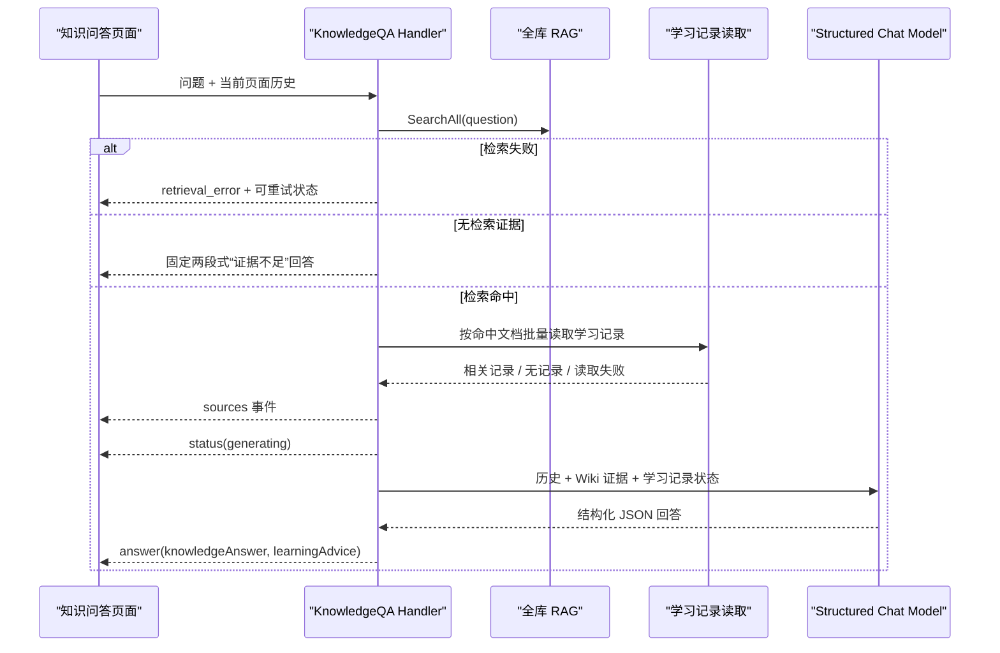

# 将 LearningCoach 重构为全库知识问答

## 目标

把现有 `/learn/feynman` 学习调度页替换为 `/learn/ask` 知识问答页。每次提问都检索用户全部 Wiki 内容，回答必须以检索证据为依据，并结合命中文档对应的学习记录给出复习建议。问答过程保持只读，不创建学习记录、不修改学习状态、不触发练习或跳转。

## 背景与约束

- 需求来源：[知识问答需求](../brainstorms/2026-07-16-knowledge-qa-requirements.md)。
- 保留内部模型配置键 `coach`，避免已有 `sys_agent_model_configs` 配置失效；它只作为兼容标识，不代表知识问答仍是 Agent。
- 不引入 Supervisor，也不让模型自行决定检索工具调用。全库 RAG、学习记录读取和无证据分支由服务端确定性编排。
- 对话只保存在当前页面 React 状态中；刷新或离开页面即清空，不新增会话表或历史接口。
- 不修改现有三种费曼练习路由及其业务。
- 按项目规则，不为普通页面布局和路由跳转添加前端测试，也不做浏览器截图验收。

## 目标数据流



## 实施单元

### 1. 增加全库检索和批量学习记录读取能力

**目标**

建立知识问答所需的两个只读数据入口：不带根目录过滤的全库 Wiki 检索，以及按多个命中文档一次性读取学习记录。

**涉及文件**

- [server/app/rag/service/retriever.go](../../server/app/rag/service/retriever.go)
- [server/app/rag/service/retriever_test.go](../../server/app/rag/service/retriever_test.go)
- [server/infrastructure/vector/qdrant.go](../../server/infrastructure/vector/qdrant.go)
- [server/infrastructure/vector/qdrant_test.go](../../server/infrastructure/vector/qdrant_test.go)
- [server/app/learning/repository/memory.go](../../server/app/learning/repository/memory.go)
- [server/app/learning/repository/memory_test.go](../../server/app/learning/repository/memory_test.go)
- [server/app/learning/service/memory.go](../../server/app/learning/service/memory.go)
- [server/app/learning/service/memory_test.go](../../server/app/learning/service/memory_test.go)

**改动**

- 在 `Retriever` 增加 `SearchAll(ctx, query, limit)`，复用现有 embedding、Qdrant 搜索和数据库回填流程，但不要求 `rootFolderID`。
- 调整 Qdrant 查询构造：只有存在过滤条件时才发送 `filter` 字段，避免用 `null` 表达全库检索。
- 保留现有 `Search` 和 `SearchDocument` 行为，确保目录内检索及练习流程不受影响。
- 为学习记录 repository/service 增加 `FindItemsByDocuments(ctx, documentIDs, limit)`：去重文档 ID，空输入直接返回空结果，按更新时间倒序并受总条数限制。
- 不使用当前 `FindItemsByUser(ctx, "", limit)` 作为全局记录来源，因为它只会命中 `folder_id IS NULL` 的记录，无法覆盖练习产生的文档级记忆。

**测试场景**

- `SearchAll` 拒绝空问题，并且不会附加根目录过滤。
- Qdrant 在过滤条件为空时不序列化 `filter`，有过滤条件时保持原结构。
- 全库检索仍返回当前文档版本和完整来源字段，包括文档标题、目录路径、标题路径和分数。
- 批量学习记录查询只返回指定文档的数据，按时间排序、遵守 limit，并正确处理重复 ID 和空 ID 列表。

**完成标准**

- 后续问答服务不需要伪造根目录 ID 即可检索全部 Wiki。
- 后续问答服务可以一次调用得到命中文档相关的学习记录，没有任何写入依赖。

### 2. 用确定性的 KnowledgeQA 服务替换 LearningCoach 调度语义

**目标**

移除“选择学习内容、调度练习、输出行动标签”的 Agent 语义，建立直接调用 structured chat model 的确定性问答服务。

**涉及文件**

- [server/infrastructure/llm/agent.go](../../server/infrastructure/llm/agent.go)
- `server/infrastructure/llm/prompts/coach.go`（删除）
- `server/infrastructure/llm/prompts/knowledge_qa.go`（新增）
- [server/infrastructure/llm/prompts/prompts_test.go](../../server/infrastructure/llm/prompts/prompts_test.go)
- `server/app/learning/service/coach.go`（删除）
- `server/app/learning/service/coach_test.go`（删除）
- `server/app/learning/service/knowledge_qa.go`（新增）
- `server/app/learning/service/knowledge_qa_test.go`（新增）
- `server/app/learning/tools/coach_tools.go`（删除）
- `server/app/learning/tools/coach_tools_test.go`（删除）

**改动**

- 删除 `NewCoachAgent`，不新增 `NewKnowledgeQAAgent`。`KnowledgeQAService` 直接创建 structured chat model，没有 ADK Runner 或工具循环。
- 将模型配置常量改名为 `AgentKeyKnowledgeQA`，值继续使用 `"coach"`，保留现有持久化配置兼容性。
- 新 prompt 要求只输出包含 `knowledge_answer` 和 `learning_advice` 的 JSON object；知识事实只能来自传入的 Wiki 证据。
- service 使用现有 `NewStructuredChatModel`，复用仓库已有的 JSON object 提取模式并严格校验两个非空字段。模型结构不合法时作为生成失败处理，不把未校验文本发给前端。
- 将历史消息、Wiki 证据和学习记录分别放入清晰的非可信数据边界，防止文档内容覆盖系统约束。
- 学习建议只使用与本次命中文档和问题相关的学习记录；无记录时固定表达“暂无相关学习记录”，读取失败时表达“学习记录暂不可用”。
- 新 service 负责请求规范化、历史裁剪、全库检索、来源去重、批量读取相关学习记录和组装模型输入。
- 历史只接受 `user` / `assistant` 角色，丢弃空内容和未完成消息；问题限制 2,000 字符，历史限制最近 12 条消息和 24,000 字符，常量在该 service 内集中定义并由服务端最终裁剪。
- 为支持带指代的追问，检索 query 由当前问题和最近两条已完成的用户问题确定性拼接，总长度限制 3,000 字符；不增加 query rewrite Agent。完整对话历史仍只进入最终回答模型。
- service 请求 8 条全库结果，并只保留 `score >= 0.65` 的命中；该初始阈值沿用现有费曼证据判断的保守基线，但使用独立常量，便于后续根据实际 embedding 模型校准。
- 只按可靠命中的文档 ID 读取最近 20 条学习记录，再要求模型仅使用陈述内容与当前问题直接相关的项目；无法建立直接关联时按“暂无相关学习记录”处理。
- 检索无结果时跳过模型，返回确定性的两个结构化字段：知识回答明确资料不足，学习建议固定为“暂无相关学习记录”，避免模型用通用知识伪装成 Wiki 证据。
- 删除 Coach 的目录列表、文档列表、记忆搜索、完成任务和行动解析代码；问答服务依赖中不注入任何写接口。

**测试场景**

- prompt 始终包含两个必填 JSON 字段、来源约束和提示注入边界，不再包含 `<ACTION>`、练习调度或工具说明。
- 结构化结果解析接受纯 JSON 和代码围栏中的 JSON，拒绝缺字段、空字段和非 JSON 自然语言。
- 历史规范化只保留合法角色和最近的完整消息，并同时满足条数、字符预算。
- 检索 query 在无历史时只包含当前问题；有历史时只带最近两条用户问题且不超过 3,000 字符，assistant 回答不会进入 embedding 输入。
- KnowledgeQA 只把达到 `0.65` 的命中视为可靠证据；零命中和全部低于阈值都进入同一个“资料不足”分支。
- 检索无证据时不调用模型，返回固定两节且明确说明证据不足。
- 有证据时来源按文档/标题位置去重，学习记录只按命中文档读取。
- 无学习记录、学习记录读取失败和正常命中三种状态进入不同的模型上下文。
- service 继续从内部键 `coach` 获取模型配置，但没有 Agent、Runner 或工具依赖。

**完成标准**

- 后端核心流程不存在 Coach action 解析和练习调度分支。
- 单次问答的所有数据读取和模型输入都可由 service 测试独立验证。

### 3. 发布结构化知识问答 SSE 接口并移除旧 Coach 接口

**目标**

提供清晰的 `POST /api/learning/ask` SSE 接口，将阶段、来源和最终双区回答作为结构化事件传给前端，并为检索、模型和学习记录部分失败定义稳定行为。

**涉及文件**

- `server/app/learning/handlers/coach.go`（删除）
- `server/app/learning/handlers/knowledge_qa.go`（新增）
- `server/app/learning/handlers/knowledge_qa_test.go`（新增）
- [server/app/learning/handlers/sse_events.go](../../server/app/learning/handlers/sse_events.go)
- [server/app/learning/handlers/sse_events_test.go](../../server/app/learning/handlers/sse_events_test.go)
- [server/app/learning/handlers/session.go](../../server/app/learning/handlers/session.go)
- [server/app/learning/router/learning.go](../../server/app/learning/router/learning.go)

**接口约定**

请求体：

```json
{
  "message": "我该怎么理解事务隔离级别？",
  "history": [
    { "role": "user", "content": "上一轮问题" },
    { "role": "assistant", "content": "上一轮回答" }
  ]
}
```

SSE 正常事件：

- `status`：当前服务端阶段；检索完成后发送 `phase: "generating"`。页面从提交请求起本地进入 `retrieving`，因此无需等待服务端首帧才显示检索状态。
- `sources`：结构化来源数组，包含 `documentId`、`documentTitle`、`folderPath`、`headingPath` 和 `score`。
- `answer`：经过服务端校验的 `knowledgeAnswer` 和 `learningAdvice` 两个字段。
- `[DONE]`：本次响应完成。

**改动**

- 新 handler 调用 KnowledgeQA service，不再在 handler 内创建工具、拼接目录列表或解析最终行动。
- 空问题直接返回 `400`；检索失败在开始流式响应前返回明确的错误响应，前端可原样进入“检索失败”状态。
- 检索命中后先发送去重后的 `sources` 和 `status(generating)`，再运行结构化模型并发送单条 `answer`，不向页面暴露原始 token 或 reasoning。
- 检索成功但无可靠证据时发送确定性的 `answer` 后结束，不发送虚假来源。
- 学习记录读取失败不终止知识回答；service 将该状态传给模型，回答的建议节明确标注暂不可用。
- 模型调用或结构校验失败时发送用户可理解的 `error` SSE 事件并结束，前端保留问题以供重试；详细上游错误只记服务端日志，不回传模型地址、凭据或内部响应。
- 删除 `session.go` 中只为 Coach 保留的 Agent 流转发函数；将 `sse_events.go` 收缩为 status、sources、answer、error 的编码辅助，不再解析 `<think>`、tool、action 或原始文本 chunk。
- 路由注册从 `/coach/chat` 替换为 `/ask`；仓库内所有调用方迁移完成后不保留旧 API。
- 当前应用是单租户且现有 `/api/learning/*` 没有鉴权中间件；新接口继承同一部署边界，不在本次重引入用户体系。服务端仍执行问题长度、history 角色和上下文预算校验，防止任意客户端放大模型请求。

**测试场景**

- 空问题返回 `400`，非法 history 项被忽略而不会进入 prompt。
- 超过 2,000 字符的问题返回 `400`；超量 history 在服务端按最近消息与字符预算裁剪。
- 检索错误与无证据是两个不同结果：前者可重试，后者是成功完成的回答。
- 有证据时 `sources`、`status(generating)` 先于 `answer` 发送且字段完整、去重稳定。
- 学习记录读取失败仍能返回知识回答；模型调用失败或 JSON 结构非法产生脱敏后的 `error` 事件。
- 正常流以 `[DONE]` 结束，输出中不存在 reasoning、stream chunk、action 或 tool 事件。

**完成标准**

- `/api/learning/ask` 是前端唯一的知识问答入口。
- API 契约可以区分“检索中、检索失败、无证据、回答生成中和生成失败”。

### 4. 建立前端问答传输层和页面内对话状态

**目标**

把 SSE 解析和多轮状态从旧页面组件中抽离，保证来源归属、失败重试、请求中止和页面内历史发送行为可独立验证。

**涉及文件**

- [web/src/api/learning/session.ts](../../web/src/api/learning/session.ts)
- [web/src/api/learning/index.ts](../../web/src/api/learning/index.ts)
- `web/src/api/learning/knowledge-qa.ts`（新增）
- `web/src/pages/learning/ask/_lib/conversation-state.ts`（新增）
- `web/src/pages/learning/ask/_lib/conversation-state.test.ts`（新增）

**改动**

- 从 `session.ts` 移除 `coachChatStream`、Coach action 和根目录选择相关类型，新增独立的 `knowledge-qa.ts`。
- 新请求函数接受 `message`、已完成历史和 `AbortSignal`，解析 `status`、`sources`、`answer`、`error` 与 `[DONE]`。
- 定义结构化 `KnowledgeQASource` 和前端流事件联合类型，不从回答 Markdown 中反向解析来源。
- 用纯状态 helper/reducer 管理消息生命周期：`retrieving`、`generating`、`completed`、`failed`。
- 重试复用原问题，但先移除对应的失败 assistant 占位，避免重复历史和重复回答。
- 发送下一问时只序列化已完成的 user/assistant 消息；pending 和 failed 消息不进入后端 history。
- 同一时间只允许一个请求；页面卸载或用户离开路由时调用 `AbortController.abort()`，中止后的请求不显示为服务端错误。
- 所有状态仅驻留内存，不接入 localStorage、sessionStorage 或服务端会话接口。

**测试场景**

- sources 和 answer 事件绑定到当前 assistant 消息，状态切换不会覆盖来源或双区内容。
- 成功完成后消息进入可用于下一轮 history 的状态。
- 检索失败和模型生成失败都保留原问题，并能无重复地重试。
- pending 和 failed 消息不会被序列化为历史。
- abort 后忽略迟到事件，并恢复可提问状态。

**完成标准**

- 页面组件只负责渲染和触发操作，不自行拼接 SSE 文本协议。
- 刷新页面后状态自然清空，连续追问能携带当前页内已完成上下文。

### 5. 替换页面、路由和产品文案，清理旧 LearningCoach UI

**目标**

上线安静的纯问答界面，迁移全部入口到 `/learn/ask`，并让旧 `/learn/feynman` 地址兼容跳转。

**涉及文件**

- [web/src/components/ai-elements/sources.tsx](../../web/src/components/ai-elements/sources.tsx)
- `web/src/components/ai-elements/sources.test.tsx`（新增）
- `web/src/pages/learning/feynman/index.tsx`（删除）
- `web/src/pages/learning/feynman/_components/coach-workspace.tsx`（删除）
- `web/src/pages/learning/feynman/_lib/action-stream-filter.ts`（删除）
- `web/src/pages/learning/feynman/_lib/action-stream-filter.test.ts`（删除）
- `web/src/pages/learning/ask/index.tsx`（新增）
- `web/src/pages/learning/ask/_components/knowledge-qa-workspace.tsx`（新增）
- `web/src/routes/_layout/learn/ask.tsx`（新增）
- [web/src/routes/_layout/learn/feynman.tsx](../../web/src/routes/_layout/learn/feynman.tsx)
- [web/src/routeTree.gen.ts](../../web/src/routeTree.gen.ts)
- [web/src/layout/sidebar/menu.ts](../../web/src/layout/sidebar/menu.ts)
- [web/src/pages/learning/session/index.tsx](../../web/src/pages/learning/session/index.tsx)
- [web/src/pages/learning/feynman-practice/index.tsx](../../web/src/pages/learning/feynman-practice/index.tsx)
- [web/src/pages/system/agent-config/agent-definitions.tsx](../../web/src/pages/system/agent-config/agent-definitions.tsx)

**改动**

- 新增 `/learn/ask` 页面；旧 `/learn/feynman` route 使用 TanStack Router `beforeLoad` 重定向到新地址。
- 侧边栏入口改为“知识问答”，所有旧页面中的 `/learn/feynman` 链接改为 `/learn/ask`。
- 系统 Agent 配置中保留 key `coach`，但名称、描述和运行时标签改为知识问答语义。
- 使用现有 `ai-elements` 的 Conversation、Message、PromptInput 和 Sources，以及现有 shadcn Alert、Button、Empty、Spinner；不新增一套自定义基础组件。
- 现有 `Source` 只能渲染外链，但 Wiki 页面没有可定位文档的 URL。扩展这个全局组件，使有 `href` 时保持链接、无 `href` 时渲染语义正确的非链接来源行；不要为了凑链接新增虚假的文档地址。
- 页面只展示对话、输入框、来源和错误重试。删除根目录选择、推理折叠区、继续学习按钮、工具调用卡片、练习跳转及 `LearningCoach` 标识。
- assistant 消息由组件固定渲染“知识回答”和“学习建议”两个标题，分别填入结构化 answer 字段，并附带 Sources；来源至少显示文档标题、目录路径、标题路径和匹配度，不虚构当前不存在的文档详情深链。
- 空白页只提供简洁的提问入口，不展示功能说明型大段文案。
- 检索中、生成中、检索失败、生成失败、无证据和无学习记录在界面上保持可区分状态；失败消息提供原位重试。
- 输入框支持 Enter 提交、Shift+Enter 换行；空输入和请求进行中禁用提交。状态文案使用可被辅助技术感知的 live region，重试或请求完成后把键盘焦点留在合理位置。
- 对话区和底部输入区使用现有组件的响应式约束，窄屏不出现横向滚动，长文档名和标题路径允许换行或截断并提供完整 tooltip。
- 重新生成 `routeTree.gen.ts`，确认三个费曼练习子路由仍然存在且未被改写。

**测试策略**

- 本单元是页面布局、路由和文案接线，按项目规则不新增页面级测试。
- `sources.test.tsx` 覆盖全局 Source 在有 `href` 时渲染链接、无 `href` 时不渲染可点击锚点；这是对复用全局组件的行为变更，符合项目允许添加前端测试的范围。
- 依赖单元 4 的状态测试覆盖多轮、来源绑定和重试行为。
- 实施完成后通过 TypeScript 检查和构建验证路由生成、API 类型和组件组合；视觉效果由用户在页面直接验收，不运行截图或浏览器自动化。

**完成标准**

- 用户从侧边栏和现有学习页面进入的都是 `/learn/ask`。
- 访问旧 `/learn/feynman` 会立即跳转且不会出现旧 Coach UI。
- 页面没有写学习记录、开始练习或改变学习状态的入口。

## 实施顺序与依赖

1. 先完成全库检索和批量记忆读取，确定底层只读能力。
2. 再完成 KnowledgeQA service、prompt 和 structured model 调用，使核心规则可单测。
3. 在核心服务稳定后发布 SSE API，并移除 Coach action 契约。
4. 根据最终 API 契约实现前端传输层和状态 helper。
5. 最后替换页面、路由和文案，集中清理旧 UI 与引用。

各单元应独立保持可编译；删除旧文件应与其替代文件在同一单元完成，避免中间状态丢失路由或模型调用入口。

## 系统级验证

- 后端：运行 RAG、Qdrant、learning repository/service/handler、prompt 相关 Go 测试，再运行受影响包的 `go test`。
- 前端：运行新增的 conversation-state 定向测试、类型检查和生产构建。
- 静态搜索：确认产品代码中不再存在 `/api/learning/coach/chat`、`navigate_to_practice`、`<ACTION`、`LearningCoach` 和指向 `/learn/feynman` 的菜单/按钮链接；兼容重定向路由本身除外。
- 写入边界：确认 KnowledgeQA handler/service 的依赖图中没有 memory create/update、learning event append、session create 或 document update 接口。
- 回归边界：确认 `/learn/feynman-practice/:documentId/listener|teacher|curator` 路由及 Wiki 的三种练习入口不受影响。

建议执行命令：

```bash
cd server
go test ./app/rag/service ./infrastructure/vector ./app/learning/repository ./app/learning/service ./app/learning/handlers ./infrastructure/llm/prompts
go test ./...

cd ../web
pnpm test:run src/pages/learning/ask/_lib/conversation-state.test.ts src/components/ai-elements/sources.test.tsx
pnpm lint:type
pnpm build
```

## 风险与应对

- **全库检索噪声或延迟增加**：继续使用有限 top-k，保留相似度分数和来源元数据；先不引入复杂 reranker，基于实际效果再调整。
- **模型偏离固定两节格式**：使用 structured model、服务端 JSON 校验和结构化 answer 事件；前端标题由组件固定渲染，不依赖模型标题或字符串切割。
- **历史上下文持续增长**：前后端都只发送/接受已完成消息，服务端最终执行条数与字符预算裁剪。
- **学习记录故障拖垮问答**：将其定义为可降级的只读附加信息，知识回答继续生成并在建议节披露不可用状态。
- **保留 `coach` 键造成命名困惑**：代码常量和运行时名称统一改为 KnowledgeQA，并在常量旁注明该值仅为持久化配置兼容键。
- **旧入口遗漏**：使用全仓静态搜索检查旧路径、旧 API 和旧 action 标识，不只依赖侧边栏人工检查。
- **相似度阈值与模型不匹配**：先沿用仓库已有的 `0.65` 基线并集中为独立常量；来源保留原始分数，后续以真实问题集调参，不把调参框架塞进本次范围。

## 不在本次范围

- 持久化问答会话、历史列表、会话标题或跨设备同步。
- 写入或自动更新学习记录、掌握度、复习计划和学习事件。
- 从回答直接启动练习、自动导航或生成操作按钮。
- 用户选择检索目录、关闭全库检索或手工选择知识源。
- 新增 Supervisor、决策 Agent、复杂 reranker 或新的数据库表。
- 改造三种费曼练习 Agent 的业务能力。

## 决策记录

- **API 采用 `POST /api/learning/ask`**：它表达通用问答而非 Coach chat，且没有资源型会话 ID。
- **模型配置键继续使用 `coach`**：这是兼容既有持久化配置的内部实现细节，不作为产品名称继续传播。
- **先检索后调用模型**：保证每一问必经全库 RAG，并让检索失败、无证据成为可确定处理的状态。
- **按命中文档读取学习记录**：比对自由文本做二次“记忆搜索”更稳定，也避免把不相关学习记录喂给模型。
- **来源走结构化 SSE 事件**：前端无需从自然语言中猜测引用，后续也能独立调整来源展示。
- **回答也走结构化 SSE 事件**：服务端校验两个字段，前端固定渲染双区，结构正确性不依赖模型遵循 Markdown 标题。
- **无证据时跳过模型**：这是阻止通用模型知识冒充 Wiki 事实的最强边界。

## 成功标准

- 用户可以在 `/learn/ask` 连续追问，刷新后对话清空。
- 每个正常问题都执行全库 Wiki 检索；有证据时显示结构化来源，无证据时明确说明不足。
- 每个回答都包含“知识回答”和“学习建议”，学习建议能区分相关记录、无记录和记录暂不可用。
- 问答链路不产生任何学习数据写入或练习动作。
- 旧 `/learn/feynman` 可兼容访问，但仓库产品语义不再出现 LearningCoach/费曼练习问答页。
- 现有三种费曼练习入口和路由保持工作。
